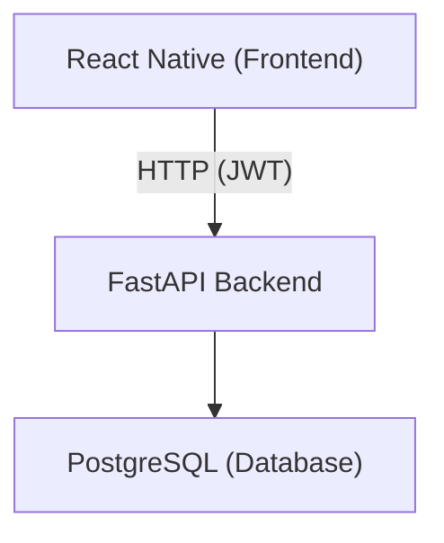

# Expense Tracker

A full-stack **Expense Tracking application** built for personal use and learning. The app allows users to track expenses and income, manage categories and budgets, and view basic financial summaries.

---

## Table of Contents
- [Project Goals](#project-goals)
- [Tech Stack](#tech-stack)
- [High-Level Architecture](#high-level-architecture)
- [Core Features](#core-features)
---

## Project Goals

- Track personal expenses and income
- Categorize financial transactions
- Set and monitor budgets
- View spending summaries over time
---

## Tech Stack

### Frontend
- **React Native**
- **TypeScript**
- **Expo**
- **React Native Web** (for browser support)

### Backend
- **Python**
- **FastAPI**
- **JWT Authentication**

### Database
- **PostgreSQL**

## High-Level Architecture

- Frontend communicates with backend via HTTP
- Backend handles authentication, validation, and business logic
- Database stores all persistent data

---

## Core Features

### Authentication
- User registration
- User login
- Password hashing
- JWT-based authentication
- Protected API routes

---

### Expense Management
- Create expense and income entries
- Edit existing entries
- Delete entries
- View expense list
- Filter and sort transactions

Each transaction includes:
- Amount
- Category
- Description
- Date
- Type (expense or income)

---

### Categories
- Predefined or user-defined categories
- Assign categories to transactions
- Filter expenses by category

---

### Summaries & Insights
- Monthly spending totals
- Income vs expense totals
- Category-based spending breakdowns

Summaries are computed by the backend and returned via API endpoints.

---
### Budgets
The budget feature allows users to **set spending limits** and **track progress** against those limits.

### Budget Capabilities
- Create a budget for:
  - A specific category (e.g., Food)
  - A time period (monthly)
- Update or delete budgets
- View remaining budget amount
- Detect when a budget is exceeded

### Example Budget Logic
- User sets a $500 monthly budget for "Food"
- Backend aggregates expenses in that category for the month
- Remaining amount is calculated and returned

### Budget Data Includes
- Budget amount
- Category
- Time period (month and year)
- Amount spent
- Amount remaining

┌──────────┐
│  users   │
├──────────┤
│ id (PK)  │◄───────────────────────────────┐
│ email    │                                │
│ password │                                │
└────┬─────┘                                │
     │                                     │
     │ 1-to-many                           │ 1-to-many
     │                                     │
┌────▼─────────┐                   ┌───────▼─────────┐
│  categories  │                   │     budgets     │
├──────────────┤                   ├─────────────────┤
│ id (PK)      │◄────────────┐     │ id (PK)         │
│ user_id (FK) │             │     │ user_id (FK)    │
│ name         │             └────►│ category_id (FK)│
│ type         │                   │ amount          │
└────┬─────────┘                   │ period          │
     │                             │ start_date      │
     │ 1-to-many                   │ is_active       │
     │                             └─────────────────┘
┌────▼────────────┐
│  transactions   │
├─────────────────┤
│ id (PK)         │
│ user_id (FK)    │
│ category_id (FK)│
│ amount          │
│ date            │
└────┬────────────┘
     │
     │ many-to-1
     │
┌────▼──────────────────┐
│ recurring_transactions│
├───────────────────────┤
│ id (PK)               │
│ user_id (FK)          │
│ category_id (FK)      │
│ frequency             │
│ next_occurrence       │
└───────────────────────┘
